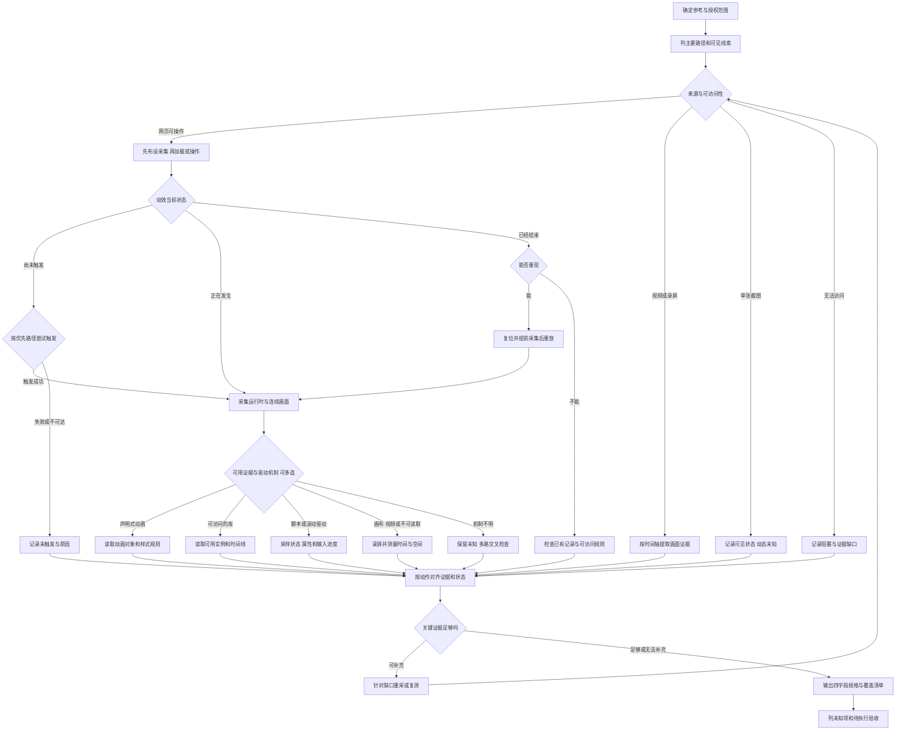

# 动效逆向工作流

同一动效可同时走多个机制分支；图是决策说明，不表示自动采集能力已实现。节点的操作方法见 [取证方法](capture.md)。

```mermaid
flowchart TD
    A[确定参考与授权范围] --> B[列主要路径和可见线索]
    B --> C{来源与可访问性}
    C -->|网页可操作| D[先布设采集 再加载或操作]
    C -->|视频或录屏| E[按时间轴提取画面证据]
    C -->|单张截图| F[记录可见状态 动态未知]
    C -->|无法访问| U[记录阻塞与证据缺口]
    D --> G{动效当前状态}
    G -->|尚未触发| H{按优先路径尝试触发}
    G -->|正在发生| I[采集运行时与连续画面]
    G -->|已经结束| J{能否重现}
    J -->|能| K[复位并提前采集后重放]
    K --> I
    J -->|不能| L[检查已有记录与可访问规则]
    H -->|触发成功| I
    H -->|失败或不可达| Y[记录未触发与原因]
    Y --> S
    I --> M{可用证据与驱动机制 可多选}
    M -->|声明式动画| N[读取动画对象和样式规则]
    M -->|可访问的库| O[读取可用实例和时间线]
    M -->|脚本或滚动驱动| P[采样状态 属性和输入进度]
    M -->|画布 视频或不可读取| Q[录屏并测量时间与空间]
    M -->|机制不明| R[保留未知 多路交叉检查]
    N --> S[按动作对齐证据和状态]
    O --> S
    P --> S
    Q --> S
    R --> S
    L --> S
    E --> S
    F --> S
    U --> S
    S --> T{关键证据足够吗}
    T -->|可补充| V[针对缺口重采或复测]
    V --> C
    T -->|足够或无法补充| W[输出四字段规格与覆盖清单]
    W --> X[列未知项和待执行验收]
```
